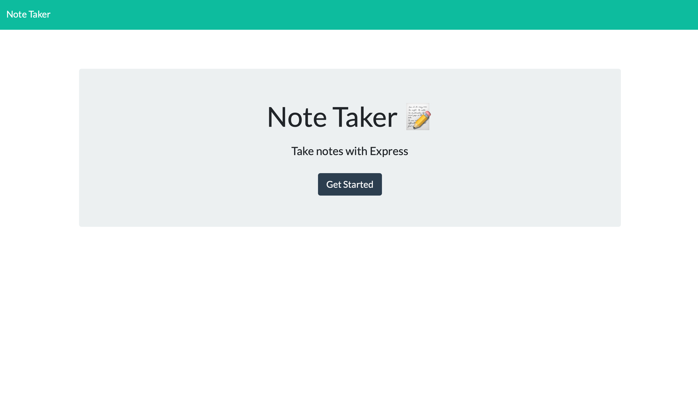

# My-Note-Taker

# Description
This is a note taker that needed a backend server to run on. This is where I came into play with creating get and post routes to run the front end of this program.

# Installation
There is no need to install just click on the link below.
https://murmuring-island-32703.herokuapp.com

# Usage
This is a simple note taker. As a user you can write down any notes you want to keep track of.

# Built With
HTML, CSS, JavaScript, Node.js, and Express

# Screenshot 

# Contribution
Charlie Cruz